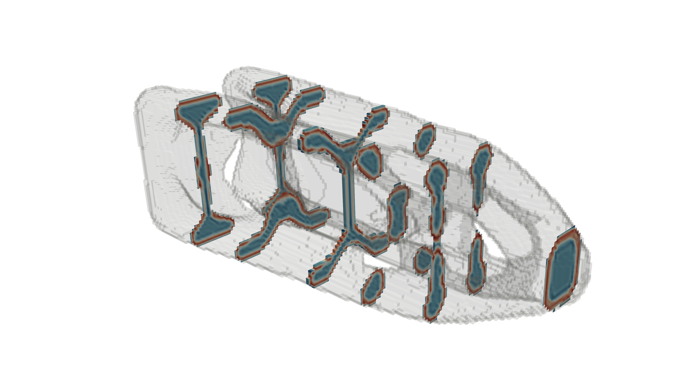

# Topology Optimization of 3D Shell Structures with Porous Infill

This repository showcases a high-performance, parallelized implementation of the 3D shell-infill topology optimization methodology, as proposed by **Clausen et al. (2017)**. This implementation is built upon the foundational **`FEniTop`** framework, a versatile and efficient FEniCSx-based platform for topology optimization.

> **Clausen, A., Andreassen, E., & Sigmund, O. (2017).**
> *Topology optimization of 3D shell structures with porous infill.*
> Acta Mechanica Sinica, 33(4), 778-791.

## Key Features

- **3D Coating Interpolation:** A specialized material interpolation model that strictly enforces a uniform solid shell (coating) over a porous or void base structure, using spatial gradients of the smoothed density field.
- **Two-Step PDE Filtering:** Employs a robust Helmholtz PDE-based filtering scheme:
  1. Base structure smoothing ($R_1$) and Heaviside projection.
  2. Shell gradient extraction ($R_2$) and secondary projection.
- **Domain Extension Technique:** Automatically pads the design domain with void regions and manipulates filter boundary conditions. This eliminates boundary truncation effects, ensuring uniform coating thickness even at the edges of the physical domain.
- **Hashin-Shtrikman Bounds:** The stiffness of the porous infill is modeled using the 3D Hashin-Shtrikman upper bounds, strictly aligning with physical limits.
- **High-Performance MPI Parallelization:** Built on `dolfinx` and `PETSc` (using `GAMG` preconditioners), allowing for the optimization of multi-million degree-of-freedom 3D structures across distributed memory clusters.
- **Real-time 3D Visualization:** Automatically generates longitudinal cross-section slices (PNG) and exports raw density fields (`.xdmf`) for `ParaView` at specified intervals without blocking the MPI execution.

## Installation

The project relies on the modern FEniCSx stack. An `environment.yml` is provided for easy setup using Conda/Mamba:

```bash
# Create the environment
conda env create -f environment.yml

# Activate the environment
conda activate fenitop
```

**Core Dependencies:**
- `python >= 3.10`
- `fenics-dolfinx >= 0.8.0` (DOLFINx)
- `mpi4py >= 3.1.0`
- `petsc4py >= 3.18.0`
- `numpy >= 1.21.0`
- `scipy >= 1.7.0`
- `pyvista >= 0.34.0`
- `numba >= 0.55.0`
- `scikit-image >= 0.19.0`

## Usage

### 1. Running an Optimization
To run the 3D MBB/Cantilever beam coating example, execute the script using `mpirun`. Adjust the number of processes (`-n`) based on your hardware:

```bash
mpirun -n 8 python3 scripts/coating_beam_3d.py
```

*Note: The script includes automated Domain Extension padding. If you encounter Out-Of-Memory (OOM / Signal 9) errors, reduce the `mesh_res_phys` or the `filter_radius` in the script to lower the degrees of freedom.*

### 2. Verifying Sensitivities
A finite difference testing script is included to verify the exactness of the analytical gradients (derived via UFL automatic differentiation and adjoint backward passes through the PDE filters).

```bash
# Run in parallel for high-speed finite difference checks
mpirun -n 4 python3 scripts/fd_check.py
```
This will output the relative error between analytical and numerical sensitivities and generate a Log-Log convergence plot.

## Optimization Design Results

Here is an example of the optimization result for a 3D cantilever beam:



## Results & Output
All results are saved in a time-stamped directory under `results/` (synchronized to UTC+8).
- `design_*.png`: Longitudinal cross-section slices showing the dense outer shell and porous/void interior.
- `design_*.xdmf`: Raw 3D density fields (`rho_total`) ready for rendering and thresholding in ParaView.

## Acknowledgements

### About the FEniTop Framework

The foundation of this project is **[`FEniTop`](https://github.com/missionlab/fenitop)**, a simple and powerful FEniCSx implementation for 2D and 3D topology optimization, as presented by Jia et al. (2024). `FEniTop` provides a robust, parallel-computing-enabled framework that serves as an excellent launchpad for exploring and implementing advanced topology optimization techniques.

### About This Project: Implementing Clausen's 3D Coating

This repository extends the capabilities of the `FEniTop` framework by integrating the specialized 3D shell-infill (coating) methodology from the seminal paper by Clausen et al. (2017). The core contribution of this work is the successful implementation of Clausen's complex, gradient-based shell definition, two-step PDE filtering, and Hashin-Shtrikman material interpolation within the modular structure of `FEniTop`.

### Role of Gemini CLI

This project was significantly accelerated and refined with the assistance of **Gemini CLI**, an AI-powered software engineering agent. Gemini's contributions spanned the entire development lifecycle, including:

-   **Rapid Prototyping & Debugging:** Assisting in the translation of complex mathematical formulations from the reference paper into functional Python code and quickly identifying and fixing bugs in the parallel MPI environment.
-   **Code Refactoring & Optimization:** Improving code modularity, enhancing the efficiency of numerical routines, and ensuring adherence to Python best practices.
-   **Sensitivity Analysis & Verification:** Automating the generation and execution of finite difference checks (`fd_check.py`) to rigorously validate the analytical gradients, a critical step for optimization convergence.
-   **Visualization & Post-processing:** Developing and debugging the `pyvista`-based visualization utilities, including generating schematic diagrams of the physical problem setup.
-   **Version Control & Documentation:** Managing the Git repository, including complex operations like history modification, remote state correction, and enriching this `README.md` file.

Gemini CLI acted as a collaborative partner, enabling the developer to focus on high-level algorithmic and theoretical aspects while handling the detailed implementation and maintenance tasks.


## Citation

If you use **fenitop** in your research or project, please cite the following work:

```text
Jia, Y., Wang, C., & Zhang, X. S. (2024). FEniTop: a simple FEniCSx implementation for 2D and 3D topology optimization supporting parallel computing. Structural and Multidisciplinary Optimization, 67(6), 84.
```

Additionally, please cite the foundational work for the 3D shell optimization theory:
> **Clausen, A., Andreassen, E., & Sigmund, O. (2017).** *Topology optimization of 3D shell structures with porous infill.* Acta Mechanica Sinica, 33(4), 778-791.

## License

This project is licensed under the **GNU General Public License v3.0**. See the [LICENSE](LICENSE) file for the full text.

