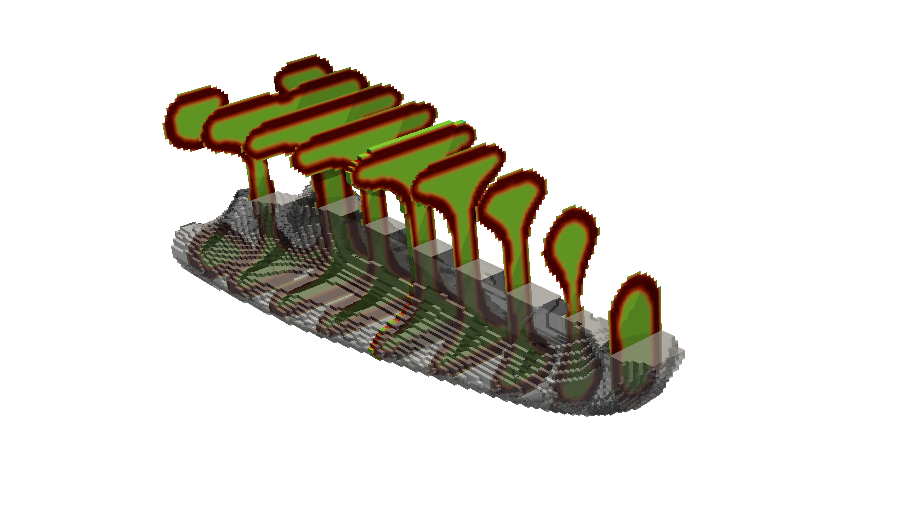

# Topology Optimization of 3D Shell Structures with Porous Infill: A Vibe Coding Case Study

[](https://www.gnu.org/licenses/gpl-3.0)


[](https://github.com/yuloveyet/Topology-Optimization-Coating3D/stargazers)
[](https://github.com/yuloveyet/Topology-Optimization-Coating3D/network/members)

This repository showcases a high-performance, parallelized implementation of the 3D shell-infill (coating) topology optimization methodology. 

## 🤖 What is Vibe Coding?

**Vibe Coding** is a modern software engineering paradigm where the developer focuses on conveying high-level architectural "vibes," mathematical intent, and physical constraints to an AI agent (in this case, **[Gemini CLI](https://geminicli.com)**), which then handles the heavy lifting of implementation, debugging, and cross-platform synchronization. 

This project serves as a **Vibe Coding Case Study**, demonstrating how complex scientific computing tasks—specifically 3D finite element analysis and gradient-based optimization—can be rapidly realized from theoretical papers (e.g., Clausen et al., 2017) into a production-ready FEniCSx environment with AI as a primary collaborative partner.

## 🏗️ Project Overview

The implementation is built upon the foundational **[`FEniTop`](https://github.com/missionlab/fenitop)** framework, extending its capabilities to realize complex, gradient-based shell definitions in a 3D [FEniCSx](https://fenicsproject.org/) environment.

## ✨ Key Features

-   **🎯 3D Coating Interpolation:** A specialized material interpolation model that strictly enforces a uniform solid shell over a porous or void base structure.
-   **⚙️ Two-Step PDE Filtering:** Employs a robust, Helmholtz PDE-based filtering scheme for multi-stage density processing.
-   **📐 Domain Extension Technique:** Automatically pads the design domain to eliminate boundary truncation artifacts and ensure uniform coating thickness.
-   **⛓️ Hashin-Shtrikman Bounds:** Models the internal porous infill stiffness using physical upper bounds for realistic material behavior.
-   **🚀 High-Performance MPI Parallelization:** Built on [FEniCSx](https://fenicsproject.org/) and `PETSc` for scalable optimization on distributed memory clusters.
-   **📊 Real-time 3D Visualization:** Generates PNG cross-sections using [`pyvista`](https://www.pyvista.org/) and XDMF fields for [`ParaView`](https://www.paraview.org/) without blocking the main execution loop.

## 📁 Project Architecture

-   **`fenitop/`**: Core framework library for filters, models, sensitivity analysis, and utilities.
-   **`scripts/`**: Ready-to-use execution and validation scripts.
-   **`results/`**: Default output directory for optimization results (PNGs and XDMF fields).

## 💾 Installation

This project relies on the modern FEniCSx stack. An `environment.yml` is provided for a streamlined setup using Conda/Mamba:

```bash
# Create the environment
conda env create -f environment.yml

# Activate the environment
conda activate fenitop
```

**Core Dependencies:**
-   `python >= 3.10`
-   `fenics-dolfinx >= 0.8.0` (DOLFINx)
-   `mpi4py >= 3.1.0`
-   `petsc4py >= 3.18.0`
-   `numpy >= 1.21.0`
-   `scipy >= 1.7.0`
-   `pyvista >= 0.34.0`
-   `numba >= 0.55.0`
-   `scikit-image >= 0.19.0`

## 🕹️ Usage

### 1. Running an Optimization
To execute the 3D MBB beam coating optimization example, run the script using `mpirun`:

```bash
mpirun -n 8 python3 scripts/coating_beam_3d.py
```
> **Note:** If you encounter Out-Of-Memory (OOM) errors, reduce `base_mesh_res` or `filter_radius` in the script.

### 2. Verifying Sensitivities
A finite difference script is provided to rigorously verify the analytical gradients:

```bash
mpirun -n 4 python3 scripts/fd_check.py
```

## 📈 Optimization Design Results

Cross-section of an optimized 3D structural beam, highlighting the dense outer shell and porous interior:



### Results & Output Format
-   `design_*.png`: High-resolution longitudinal cross-sections.
-   `design_*.xdmf`: Raw 3D density fields for advanced rendering in [ParaView](https://www.paraview.org/).

## 🙏 Acknowledgements

### About the FEniTop Framework
The foundation of this codebase is **[`FEniTop`](https://github.com/missionlab/fenitop)**, a simple and powerful parallel FEniCSx implementation for topology optimization by **Jia et al. (2024)**.

### About This Project
This repository extends the `FEniTop` framework by integrating the specialized 3D shell-infill methodology from **Clausen et al. (2017)**.

### Role of Gemini CLI
Development was significantly accelerated with the assistance of **[Gemini CLI](https://geminicli.com)**, which acted as a collaborative AI partner.

## 📚 Citation

If you use this code, please cite the foundational framework:

> **Jia, Y., Wang, C., & Zhang, X. S. (2024).**
> *FEniTop: a simple FEniCSx implementation for 2D and 3D topology optimization supporting parallel computing.*
> Structural and Multidisciplinary Optimization, 67(6), 84.
> [DOI: 10.1007/s00158-024-03780-6](https://doi.org/10.1007/s00158-024-03780-6)

And the theoretical foundation for the 3D shell-infill methodology:

> **Clausen, A., Andreassen, E., & Sigmund, O. (2017).**
> *Topology optimization of 3D shell structures with porous infill.*
> Acta Mechanica Sinica, 33(4), 778-791.
> [DOI: 10.1007/s10409-017-0637-x](https://doi.org/10.1007/s10409-017-0637-x)

## ⚖️ License

This project is licensed under the **GNU General Public License v3.0**. See the [LICENSE](LICENSE) file for the full text.
